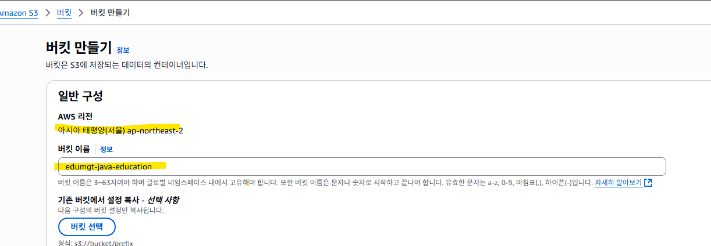
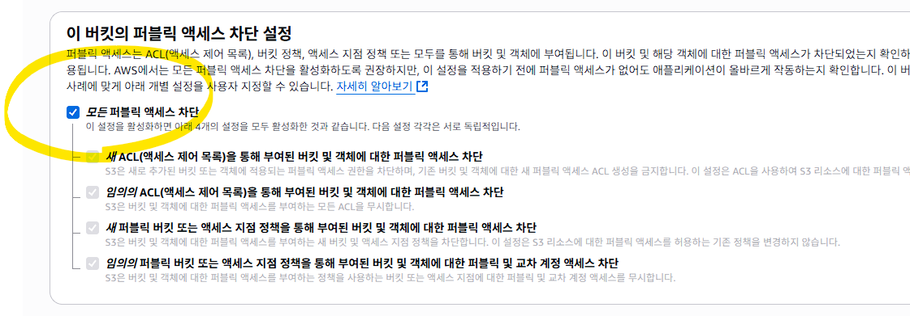

## 첨부의 4개 Overwatch 한조 얼굴 이미지를 비교하는 예시

## 첨부한 xlsx 파일은 기술스택 예시 파일 입니다.

## nvm ls
## 위의 명령으로 사용 node 버젼 확인 및 사용할 node 선택
## nvm use 18.12.0

## 각 실행 방법
## npm run compare , npm run extract

## S3 연동 예제 추가
## 동일 IAM 사용자에게 AmazonS3FullAccess 권한 설정

## 위의 이미지와 같이 1번의 IAM User 확인, 2번의 직접 연결 선택, 3 의 검색 부분에 AmazonS3FullAccess 입력으로 찾기

## .env 에 다음을 추가
## S3_BUCKET_NAME=edumgt-java-education
## S3_BUCKET_REGION=ap-northeast-2

## S3 버킷 생성 (한 번만)
## S3 콘솔 접속: https://s3.console.aws.amazon.com/s3/

## 버킷 만들기 클릭

## 버킷 이름: your-bucket-name (고유해야 함)
## 리전: ap-northeast-2 (서울)
## 퍼블릭 액세스 차단

## upload.js 를 npm run upload 로 실행 결과 다음과 같이 S3 에 이미지 확인

